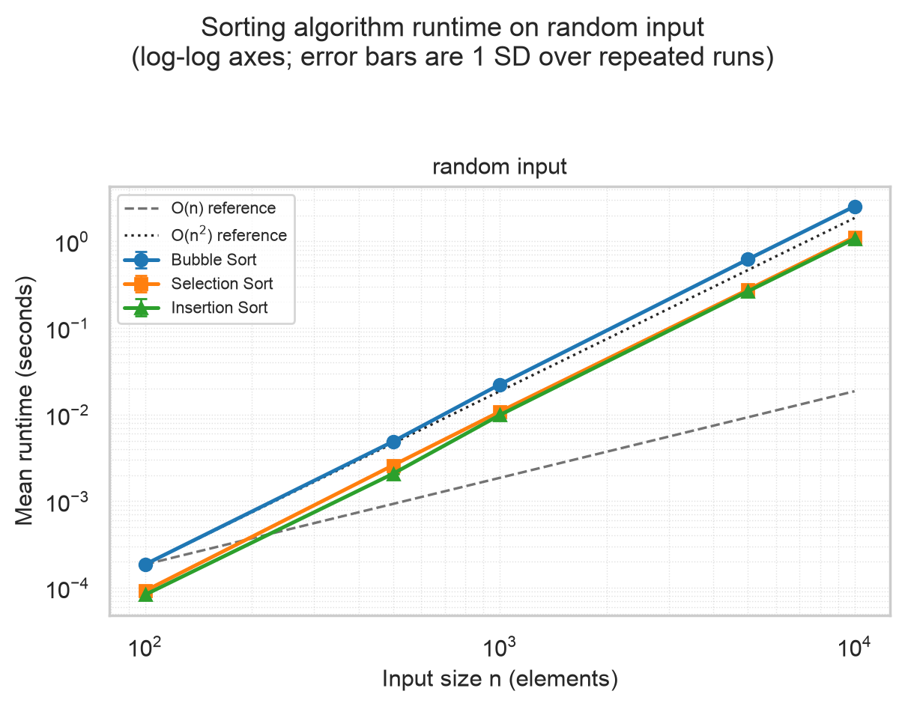
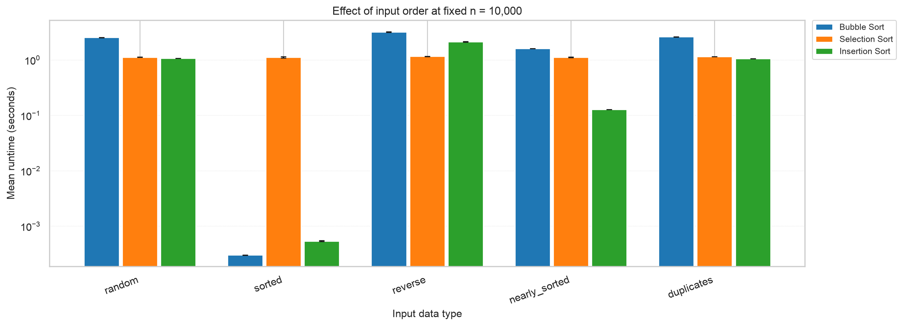
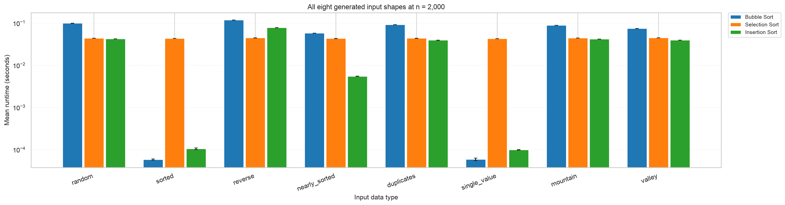
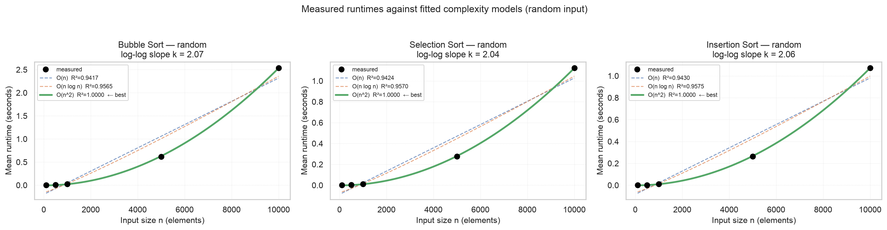

# CSC 5300 Advanced Algorithms — Week 1 Project: Algorithm Laboratory Setup

**Robert Deibel**  
Concordia University Texas · CSC 5300 Advanced Algorithms · Fall 2026  
Week 1 Project — Algorithm Laboratory Setup (30 points)  
Submitted: August 30, 2026

---

## 1. A note on submission format

The assignment instructions specify what the project must contain but do
not state what form the submission should take. The Blackboard submission
page accepts a text entry and a file upload, and the instructions, the
submission checklist, and the Week 1 course materials all describe the
required *contents* rather than a required upload format. I have therefore
submitted this summary document together with a zipped copy of the
complete repository, and included the public repository URL so that the
commit history — version control being one of the stated learning
objectives — can be reviewed directly.

**Repository:** <https://github.com/RDeibel2025/CTX-Advanced-Algorithms>

---

## 2. What was built

### Part 1 — Environment setup

A Python 3.12.4 virtual environment (`algorithms_course/`) with all nine
packages from the reading installed, pinned in
[`requirements.txt`](requirements.txt) by `pip freeze`.

[`check_environment.py`](check_environment.py) is the environment
verification script. It:

* reports the interpreter version and fails hard below Python 3.9;
* imports all nine required packages and reports each installed version,
  naming any that are missing together with the `pip install` command that
  would fix them;
* confirms all 14 required directories and all 27 required files exist and
  are non-empty, naming anything absent;
* confirms `git` is on PATH and the project is inside a working tree;
* warns if it is running outside the project virtualenv — the usual reason
  a check like this passes on a machine where the project does not
  actually work;
* exits `0` on success and `1` on any failure.

Its real output is in §3 below.

### Part 2 — Project structure

The full semester layout exists as real Python packages. Directories
scoped to later weeks — `src/searching/`, `src/graph/`,
`src/dynamic_programming/`, `src/data_structures/` — each carry an
`__init__.py` documenting what they are reserved for, so the structure is
complete rather than merely present. `src/sorting/advanced_sorts.py`,
`benchmarks/complexity_validation.py` and `tests/test_searching.py` are
documented placeholders, not empty files. The tree is in §6.

Supporting files: [`setup.py`](setup.py) (installable with `pip install
-e .`), [`.gitignore`](.gitignore), and
[`.github/workflows/tests.yml`](.github/workflows/tests.yml), which runs
the test suite and the doctests on every push.

One `.gitignore` detail worth noting: the book's version ignores `*.csv`,
but the benchmark results are graded evidence, so
`!benchmarks/results/*.csv` re-includes them. I verified with `git
check-ignore` that the results files are genuinely tracked.

### Part 3 — Sorting algorithms

[`src/sorting/basic_sorts.py`](src/sorting/basic_sorts.py) — bubble sort
(optimized), selection sort and insertion sort.

All three share one contract: `TypeError` on non-list input, no mutation
of the caller's list, a new list returned, empty and single-element input
handled without the caller special-casing, and any comparable element type
accepted — verified in the tests against integers, floats, strings,
tuples and booleans.

Bubble sort carries the **early-exit flag**: a pass that completes without
a swap returns immediately, making already-sorted input O(n). It also
shrinks the scanned range by one each pass. §4 shows this is worth a
factor of about 8,450 in practice.

Every function documents its arguments, return value, raised exceptions,
best/average/worst time complexity, space complexity and stability, and
carries executable examples — 35 of which run as doctests.

### Part 4 — Benchmarking framework

[`src/utils/benchmark.py`](src/utils/benchmark.py) provides
`BenchmarkResult` and `AlgorithmBenchmark`, matching the interface in the
reading.

* **Eight data generators** — `random`, `sorted`, `reverse`,
  `nearly_sorted`, `duplicates`, `single_value`, `mountain`, `valley` —
  all honouring a `seed` argument, using a dedicated `random.Random`
  instance so global random state is never disturbed.
* **Timing** with `time.perf_counter()`, discarding warm-up runs, then
  timing each of several runs individually and reporting mean, sample
  standard deviation, minimum and maximum. The defensive copy of the input
  is made outside the timed region, and correctness verification happens
  after the clock stops, so neither enters the measurement.
* **Correctness verification** on every timed run: the output must be
  ordered *and* a multiset permutation of the input. Both are needed —
  ordering alone accepts a sort that drops an element, permutation alone
  accepts a sort that orders nothing.
* **Complexity analysis** fitting O(n), O(n log n) and O(n²) with
  `scipy.optimize.curve_fit`, reporting R² for all three plus an
  independent log–log slope estimate.
* **Visualization** — log-log comparison charts with O(n) and O(n²)
  reference curves and standard-deviation error bars, plus supplementary
  charts in [`src/utils/visualization.py`](src/utils/visualization.py):
  input-order sensitivity, fitted-model overlays, and runtime normalised
  by n². All written to `docs/figures/` at 200 dpi.
* **Storage and retrieval** — `export_results()` writes CSV or JSON;
  `load_results()` reads them back into `BenchmarkResult` objects, so a
  completed sweep can be re-plotted or re-analysed without re-running it.

[`benchmarks/sorting_benchmarks.py`](benchmarks/sorting_benchmarks.py) is
the runnable driver that exercises all of it end to end.

### Part 5 — Testing and performance analysis

[`tests/`](tests) holds 245 tests (§3). The report is
[`docs/performance_analysis.md`](docs/performance_analysis.md) with charts
in [`docs/figures/`](docs/figures) — findings in §4.

---

## 3. Environment and verification

### `python check_environment.py` — exits 0

```
========================================================================
CSC 5300 Advanced Algorithms — Environment Check
Robert Deibel · Week 1 Project: Algorithm Laboratory Setup
========================================================================

1. Python interpreter
---------------------
       executable : .../Advanced Algorithms/algorithms_course/bin/python
       platform   : macOS-14.5-arm64-arm-64bit
       machine    : arm64
[ OK ] Python 3.12.4 (requires 3.9+)
[ OK ] Running inside a virtual environment: .../algorithms_course

2. Required packages
--------------------
[ OK ] numpy          2.5.2
[ OK ] matplotlib     3.11.1
[ OK ] pandas         3.0.5
[ OK ] jupyter        1.1.1
[ OK ] pytest         9.1.1
[ OK ] scipy          1.18.1
[ OK ] scikit-learn   1.9.0  (imports as 'sklearn')
[ OK ] plotly         7.0.0
[ OK ] seaborn        0.13.2
[ OK ] All 9 required packages are installed.

3. Project structure
--------------------
       root       : .../CTX Masters/Advanced Algorithms
[ OK ] All 14 required directories present.
[ OK ] All 27 required files present.

4. Version control
------------------
[ OK ] git version 2.39.5 (Apple Git-154)  (/usr/bin/git)
[ OK ] Project directory is inside a Git working tree.
[ OK ] origin remote: https://github.com/RDeibel2025/CTX-Advanced-Algorithms.git

Summary
-------
[ OK ] Python interpreter
[ OK ] Required packages
[ OK ] Project structure
[ OK ] Version control

[ OK ] All 4 checks passed. Environment is ready.
```

| | |
|---|---|
| Machine | Apple M2 Max, 12 logical cores, 64 GB RAM |
| Operating system | macOS 14.5 (Darwin 23.5.0), arm64 |
| Python | 3.12.4 (CPython) in the project virtualenv |
| Packages | numpy 2.5.2 · matplotlib 3.11.1 · pandas 3.0.5 · jupyter 1.1.1 · pytest 9.1.1 · scipy 1.18.1 · scikit-learn 1.9.0 · plotly 7.0.0 · seaborn 0.13.2 |

---

## 4. Test results

### `pytest tests/ -v`

```
============================= 245 passed in 2.18s ==============================
```

**245 tests, all passing. No failures, no errors, no skips.**

### `pytest --doctest-modules src/ -v`

```
============================== 35 passed in 1.20s ==============================
```

**35 docstring examples, all passing** — every `>>>` example in the source
is executed and checked.

### What the 245 tests cover

**Sorting algorithms.** All required edge cases run against all three
algorithms by parametrisation: empty list, single element, two elements in
both orders, already sorted, reverse sorted, duplicates, all elements
identical, negatives, mixed positive and negative, floats, strings,
tuples, a 1,000-element random array, and 500-element sorted and reverse
arrays. Output correctness is always checked as *both* properties at once
— ordered and a permutation — and additionally against Python's own
`sorted()` on 200 randomly generated arrays per algorithm.

**Contract.** `TypeError` is asserted for nine different non-list argument
types, with the message checked for naming both the function and the type
received. Non-mutation is asserted across every fixture case, along with
the returned list being a distinct object.

**Stability.** Bubble and insertion sort are verified to preserve the
relative order of equal keys; selection sort's known instability is pinned
by a characterisation test. This required a record type that orders on its
key alone — a plain `(key, tag)` tuple cannot test stability, because
tuple comparison breaks ties on the tag and makes every sort look stable.

**The optimization, by counting rather than timing.** Bubble sort's early
exit is verified by instrumenting the elements and counting comparisons:
exactly n−1 on sorted input where the naive version would make n(n−1)/2.
Selection sort's comparison count is verified constant at n(n−1)/2 across
sorted, reverse and random input, and insertion sort's is verified at n−1
on sorted input and n(n−1)/2 on reverse.

**The framework.** All eight data generators are checked for the property
each promises; seeding is checked for reproducibility and for actually
varying with the seed; `time_algorithm` is checked for a well-formed,
internally consistent result and for discarding exactly the right number
of warm-up runs; correctness verification is checked to *reject* three
differently broken sorts — including one whose output is perfectly ordered
but one element short; results are checked to survive a CSV and a JSON
round trip; and every chart function is checked to write a real,
non-trivial PNG.

---

## 5. Benchmark results

The full study ran in **187.0 seconds** — 3 algorithms × 5 sizes × 5 data
types × 5 measured runs, after 2 discarded warm-up runs per configuration,
seeded at 42. **No configuration was reduced or omitted for runtime.**

A second study held n = 2,000 constant across all eight generated shapes,
and a third profiled peak memory with `tracemalloc` outside the timed
runs.

Raw data:
[`benchmarks/results/sorting_benchmark_results.csv`](benchmarks/results/sorting_benchmark_results.csv)
(75 rows) ·
[`complexity_fits.csv`](benchmarks/results/complexity_fits.csv) ·
[`data_shape_study.csv`](benchmarks/results/data_shape_study.csv) ·
[`memory_profile.csv`](benchmarks/results/memory_profile.csv).

### Mean runtime at n = 10,000 (seconds)


| Algorithm | `random` | `sorted` | `reverse` | `nearly_sorted` | `duplicates` |
|---|---|---|---|---|---|
| Bubble Sort | 2.535432 | 0.000300 | 3.203425 | 1.608625 | 2.616826 |
| Selection Sort | 1.123140 | 1.119904 | 1.158615 | 1.119488 | 1.147750 |
| Insertion Sort | 1.071705 | 0.000538 | 2.125202 | 0.127290 | 1.053461 |

### Empirical complexity fit per configuration

| Algorithm | `random` | `sorted` | `reverse` | `nearly_sorted` | `duplicates` |
|---|---|---|---|---|---|
| Bubble Sort | O(n²) (k=2.07) | O(n) (k=1.09) | O(n²) (k=2.09) | O(n²) (k=2.10) | O(n²) (k=2.10) |
| Selection Sort | O(n²) (k=2.04) | O(n²) (k=2.07) | O(n²) (k=2.06) | O(n²) (k=2.07) | O(n²) (k=2.08) |
| Insertion Sort | O(n²) (k=2.06) | O(n) (k=1.05) | O(n²) (k=2.07) | O(n²) (k=1.92) | O(n²) (k=2.07) |

*k* is the log–log slope, an estimate of the exponent that is independent
of the fitted models. Every fit has R² ≥ 0.9996.

### Findings

**All three algorithms are quadratic on unordered input, confirmed three
independent ways.** On `random`, `reverse` and `duplicates` input the
fitted model is O(n²) with R² ≥ 0.9996 in all nine cases; the log–log
slope lands between 2.04 and 2.10 against a theoretical 2; and doubling
the input from n = 5,000 to n = 10,000 multiplies the runtime by close to
4, which is what a quadratic algorithm should do. Model fitting alone
would be weak evidence — three measures agreeing is not.

**Bubble sort's early-exit optimization is worth a factor of about
8,450.** On sorted input at n = 10,000 it finishes in 0.000300 s against
2.535432 s on random input of the same size, and the fit selects O(n)
rather than O(n²). Counting comparisons directly shows why: exactly
n−1 = 999 comparisons at n = 1,000, where the unoptimized version would
make 499,500. That single `if not swapped: break` is the whole difference
between a linear and a quadratic best case, which is what makes "correct
*and* optimized" two separate requirements rather than one.

**Selection sort's runtime is flat across every input shape, and the
reason is countable.** Across the five swept data types at n = 10,000 its
runtime varies by a coefficient of variation of 1.60% and a spread of only
1.03× between its fastest and slowest — of the same order as the
measurement noise itself. Over all eight shapes in the second study the
result is the same. By contrast, bubble sort spans a factor of
more than 8,000 across the same inputs and insertion sort nearly 4,000. The mechanism
is not a timing artefact: counting comparisons shows selection sort
performing **exactly 499,500 = n(n−1)/2 comparisons on every single data
type**, an identical integer in all five cases. It must scan the entire
unsorted suffix to find its minimum, and nothing it sees along the way
lets it conclude the suffix was already ordered. That is a property of the
algorithm, not an omission in the implementation, and it gives selection
sort its one genuine virtue: it is the only one of the three whose
runtime is predictable from n alone.

**Insertion sort's best case is real — but "nearly sorted" turned out not
to be one.** On fully sorted input, insertion sort is selected as O(n) and
runs 1,992× faster than on random input. On `nearly_sorted` input it is
8.4× faster than on random — a large win — but its empirical exponent is
1.92 and its doubling ratio 3.84, so the fit still selects **O(n²)**. It
gains a constant factor, not a better complexity class.

I went looking for the reason rather than reporting the expected answer,
and the mechanism is in the data generator. `nearly_sorted` applies
⌊0.05n⌋ transpositions between *randomly chosen* positions, not between
neighbours, so each one displaces an element by O(n) positions on average
and the total inversion count stays Θ(n²) — smaller than random input by a
factor of about 8, which matches the measured speedup almost exactly, but
quadratic all the same. Insertion sort's true cost is Θ(inversions + n),
which is linear only when the inversions are O(n). A definition based on
*local* perturbation would show the linear collapse. That is a difference
in the input definition, not in the algorithm.

The same input separates the two adaptive algorithms sharply: insertion
sort's comparisons fall by 8.4× on it, while bubble sort's fall by only
2.6%. Bubble sort moves a misplaced element left by one position per pass,
so a single element displaced by 500 positions costs 500 passes and the
early-exit flag cannot fire until the last inversion is gone.

**Bubble sort is the slowest of the three on unordered input.** At
n = 10,000 on random input it is 2.37× slower than insertion sort. Roughly
half of that is comparison count — 499,149 against insertion sort's
254,591 — and the rest is the cost per iteration: bubble sort indexes the
list twice per comparison and its swap performs two stores, where
insertion sort holds the travelling element in a local variable.

**Memory is identical across the three, as it should be.** Peak allocation
at n = 1,000 is about 8.1 KiB for all three — 8.3 bytes per element — one copy of the input list
and nothing more, confirming O(1) auxiliary space in every case.

**One measurement does not fit, and it is reported rather than smoothed.**
Among the 13 configurations classed as quadratic, twelve have doubling
ratios near 4; selection sort on `duplicates` gives 3.74, because its
n = 5,000 measurement on that data type is elevated relative to the same
algorithm and size on the other four data types. Its own standard
deviation does not explain it. The lesson is a real limitation of the
method: a per-configuration standard deviation captures jitter *within*
five consecutive runs and cannot see drift *between* configurations
measured minutes apart. Interleaving the configuration order across
repeated passes would expose that, and is the first thing I would change.

### Key figures



*Runtime against input size on log–log axes, random input. Error bars are
one standard deviation over five runs. All three series run parallel to
the dotted O(n²) reference across two orders of magnitude of n, and
clearly steeper than the dashed O(n) reference.*



*The same three algorithms at one fixed size across the five swept data
types, on a logarithmic runtime axis. Selection sort (orange) is the same
height in every group; bubble sort (blue) and insertion sort (green)
collapse by three to four orders of magnitude on sorted input.*



*The second study: all eight generated shapes at fixed n = 2,000.
Selection sort's bars are the same height eight times over — the visual
form of its constant n(n−1)/2 comparison count.*



*Measurements (black dots) against all three fitted models on random
input, with each model's R² in the legend. The O(n) and O(n log n) curves
cannot follow the data; the O(n²) curve passes through every point.*

### All figures

All charts are in [`docs/figures/`](docs/figures) and embedded in
[`docs/performance_analysis.md`](docs/performance_analysis.md):

| File | What it shows |
|---|---|
| `sorting_comparison_all_data_types.png` | Runtime vs. size, log–log, one panel per data type, with O(n) and O(n²) reference curves |
| `sorting_comparison_random.png` | The same for random input alone |
| `data_type_sensitivity.png` | Effect of input order at fixed n = 10,000 |
| `data_shape_study.png` | All eight generated shapes at n = 2,000 |
| `complexity_fits_random.png` | Measurements against all three fitted models, random input |
| `complexity_fits_sorted.png` | The same on sorted input, where the algorithms diverge |
| `normalized_runtime_random.png` | Runtime ÷ n², a direct test of the quadratic hypothesis |
| `normalized_runtime_sorted.png` | The same on sorted input |

Every number in the analysis report is computed from the result CSVs by
[`tools/build_report.py`](tools/build_report.py) at render time rather
than typed in, so the write-up cannot drift out of step with the data.

---

## 6. Repository structure

```
Advanced Algorithms/                  <- repository root
├── README.md
├── SUBMISSION.md                     <- this document
├── requirements.txt
├── setup.py
├── check_environment.py
├── .gitignore
├── .github/
│   └── workflows/
│       └── tests.yml
├── src/
│   ├── __init__.py
│   ├── sorting/
│   │   ├── __init__.py
│   │   ├── basic_sorts.py            bubble (optimized), selection, insertion
│   │   └── advanced_sorts.py         reserved for a later week
│   ├── searching/__init__.py         reserved for a later week
│   ├── graph/__init__.py             reserved for a later week
│   ├── dynamic_programming/__init__.py   reserved for a later week
│   ├── data_structures/__init__.py   reserved for a later week
│   └── utils/
│       ├── __init__.py
│       ├── benchmark.py              BenchmarkResult, AlgorithmBenchmark
│       ├── visualization.py          supplementary charts
│       └── testing_helpers.py        shared predicates, StabilityRecord
├── tests/
│   ├── __init__.py
│   ├── conftest.py                   sample_arrays, large_random_array
│   ├── test_sorting.py               algorithm tests
│   ├── test_searching.py             reserved for a later week
│   └── test_utils.py                 framework tests
├── benchmarks/
│   ├── __init__.py
│   ├── sorting_benchmarks.py         the Week 1 benchmark driver
│   ├── complexity_validation.py      reserved for a later week
│   └── results/
│       ├── sorting_benchmark_results.csv
│       ├── data_shape_study.csv
│       ├── complexity_fits.csv
│       └── memory_profile.csv
├── docs/
│   ├── performance_analysis.md       the performance report
│   ├── AI_USE.md                     AI use disclosure
│   └── figures/                      8 generated PNG charts
├── tools/
│   ├── build_report.py               renders the report from the result CSVs
│   ├── md_to_pdf.py                  exports SUBMISSION.md to PDF
│   └── package_submission.sh         builds the two files below
├── submissions/
│   └── week-01-algorithm-lab/
│       ├── Deibel_CSC5300_Week1_AlgorithmLab.zip
│       └── Deibel_CSC5300_Week1_Submission.pdf
├── notebooks/                        reserved for exploratory work
└── examples/                         reserved for worked examples
```

The repository covers the whole course, not just this assignment: the
`searching`, `graph`, `dynamic_programming` and `data_structures` packages
are in place for later weeks, and each week's submitted artifacts get their
own folder under `submissions/`.

The virtual environment (`algorithms_course/`), `__pycache__/` and
`.pytest_cache/` are excluded from version control and from this archive.
`submissions/` is tracked but excluded from the archive as well — otherwise
this zip would contain a copy of itself.

### Commit history

Version control is one of the stated learning objectives, so the work was
committed at each phase boundary rather than squashed at the end:

```
1c02866  Add performance analysis report and figures
2102c6d  Add benchmark driver and the measured results
19ae600  Add comprehensive test suite
6649ab3  Add benchmarking framework with visualization
3d82728  Implement bubble, selection, and insertion sorts
ce19bbb  Add environment check script
90826dd  Initial project setup with proper structure
```

---

## 7. Submission checklist

| # | Item | How it is satisfied |
|---|---|---|
| 1 | Environment check script runs successfully | `python check_environment.py` exits 0; full output in §3. Checks the Python version, all nine packages, all 14 directories and 27 files, and Git. |
| 2 | All three sorting algorithms implemented and working | `src/sorting/basic_sorts.py` — bubble (with the early-exit optimization), selection, insertion. Verified by 245 tests and by 375 correctness-checked benchmark executions. |
| 3 | Benchmarking framework creates visualizations | `src/utils/benchmark.py` and `src/utils/visualization.py`. Eight charts written to `docs/figures/` at 200 dpi, with log-log axes, error bars, legends, labelled axes and O(n)/O(n²) reference curves. |
| 4 | All tests pass (`pytest tests/ -v`) | **245 passed**, 0 failed, 0 skipped. Plus 35 doctests via `pytest --doctest-modules src/`. |
| 5 | Performance report includes charts and analysis | `docs/performance_analysis.md` — methodology, results with standard deviations, empirical complexity fits, and conclusions, with all eight charts embedded. Findings summarised in §5 above. |
| 6 | `README.md` includes Robert Deibel's name | Named in the second line of `README.md`, and in the author line of every source module. |
| 7 | Code is well-commented and documented | Every public function documents its arguments, return value, exceptions, time and space complexity, stability, and carries executable examples — 35 of which run as doctests in CI. |
| 8 | No unnecessary files (`.pyc`, `__pycache__`) | `.gitignore` excludes the virtualenv, `__pycache__/`, `*.pyc` and `.pytest_cache/`; the working tree is clean and none are present in this archive. |

---

## 8. AI use acknowledgement

Concordia University Texas's policy requires that any use of AI be
acknowledged, that text copied directly from an AI tool be cited as a
direct quote, and that other uses be clearly described at the end of the
assignment. This section is that description; a fuller file-by-file
account is in [`docs/AI_USE.md`](docs/AI_USE.md).

**Tool.** Anthropic Claude, via the Claude Code command-line agent, run
locally on my machine. No other AI tool was used.

**How it was used.** I wrote a detailed specification of the assignment's
requirements — derived from the Blackboard instructions, the Detailed
Grading Criteria, and Chapter 1 §§1.6–1.10 of Amakobe, *Advanced
Computational Algorithms* (2nd ed., 2026) — and directed the tool to
implement the project against it. The model drafted the code, the test
suite, and the first draft of the written documents. I specified the
requirements, directed the work, reviewed the output, ran the tests and
benchmarks, and decided what the report was entitled to claim.

**What was AI-generated.** Essentially all of the source code
(`src/`, `tests/`, `benchmarks/`, `tools/`, `check_environment.py`,
`setup.py`, the CI workflow) and the first draft of the prose in
`README.md`, `docs/performance_analysis.md`, `docs/AI_USE.md` and this
document, along with the Git commit messages.

**What was not.** The measurements. Every timing, standard deviation,
complexity fit, comparison count and chart was produced by actually
running `benchmarks/sorting_benchmarks.py` on my machine — an Apple M2 Max
under macOS 14.5 and Python 3.12.4, taking 187 seconds. Nothing was
estimated, adjusted or invented. To make that checkable rather than merely
asserted, every number in the analysis report is computed from the result
CSVs by `tools/build_report.py` at render time, so no figure in the
write-up was ever typed in by hand.

The judgement calls are also mine — in particular the decision in §5 to
report that insertion sort does *not* become linear on this project's
`nearly_sorted` data, which contradicts the usual textbook shorthand but
is what the measured exponent and doubling ratio show. Finding that the
numbers disagreed with the expectation, and working out why, was the part
of this assignment most worth doing.

**Direct quotation.** None. No text produced by the AI tool is presented
here as a quotation from a source, and no text from any source is
reproduced verbatim without attribution.

**Other sources.** The Blackboard assignment instructions, submission
checklist and Detailed Grading Criteria; Amakobe, *Advanced Computational
Algorithms*, 2nd ed. (2026), Chapter 1 §§1.6–1.10; and the standard
library and package documentation for Python 3.12, pytest, matplotlib,
scipy and pandas.
