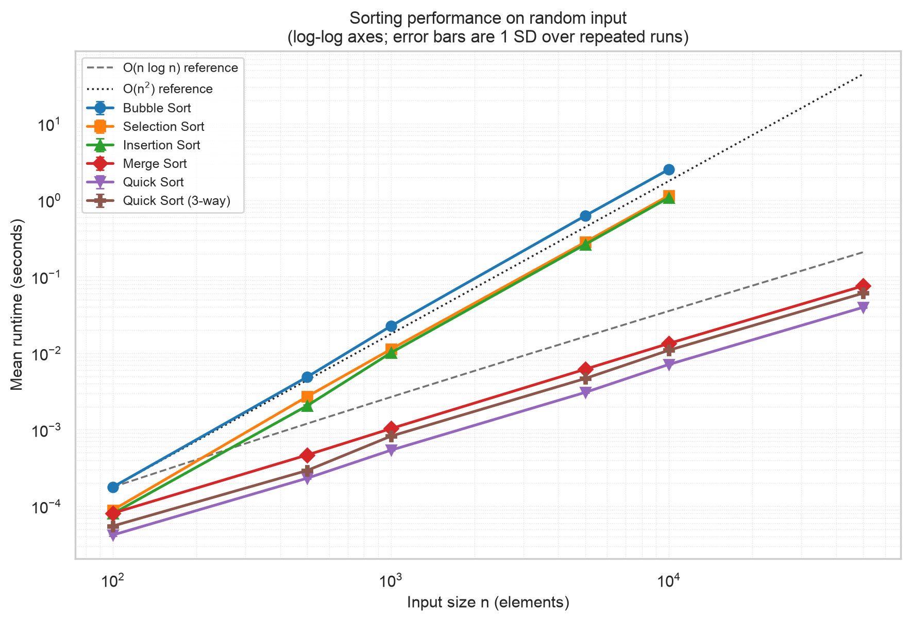
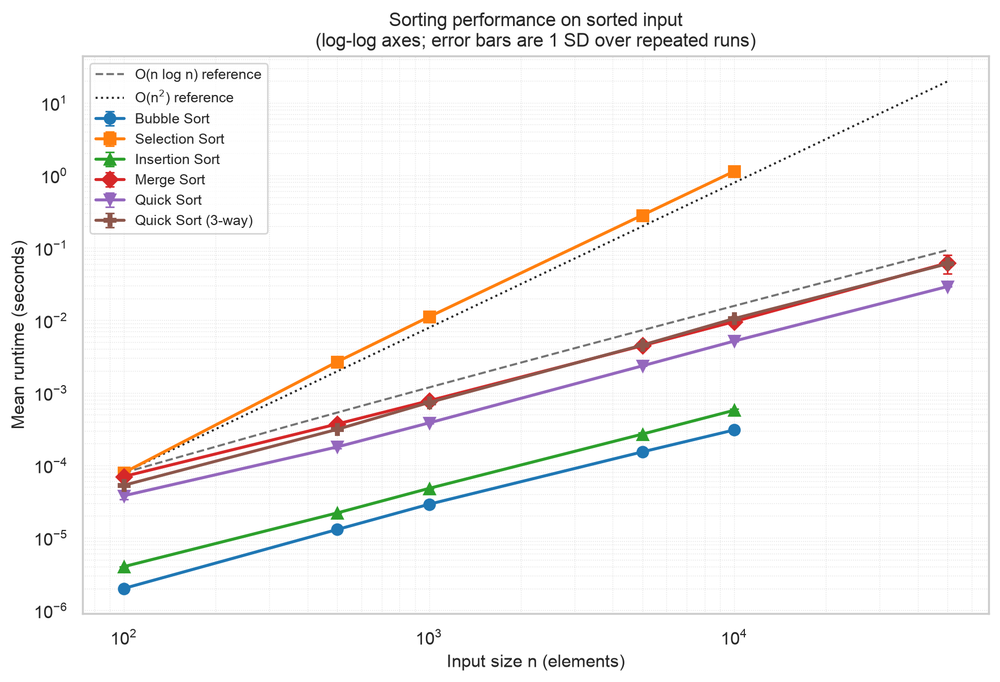
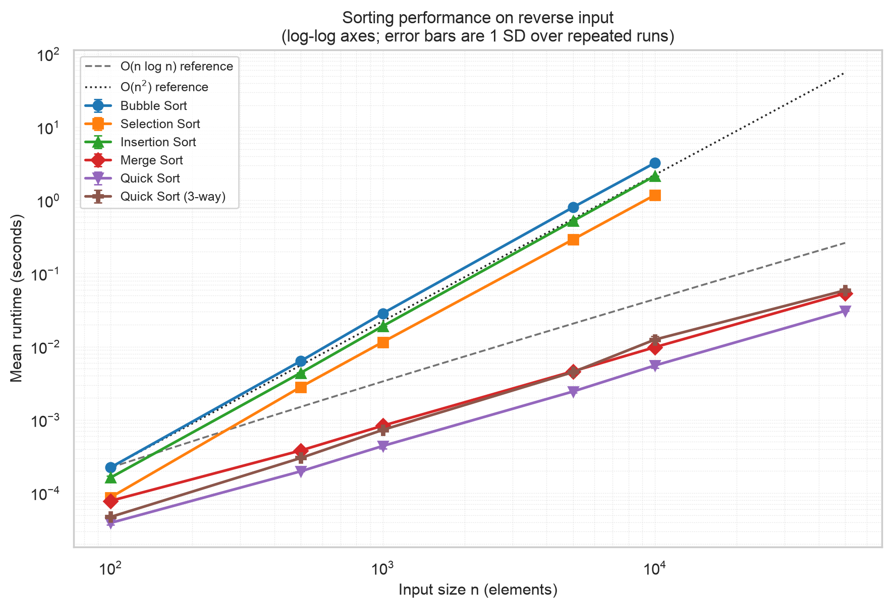
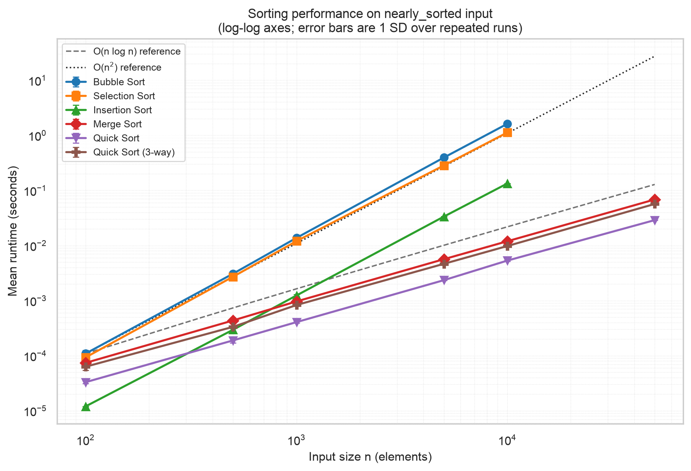
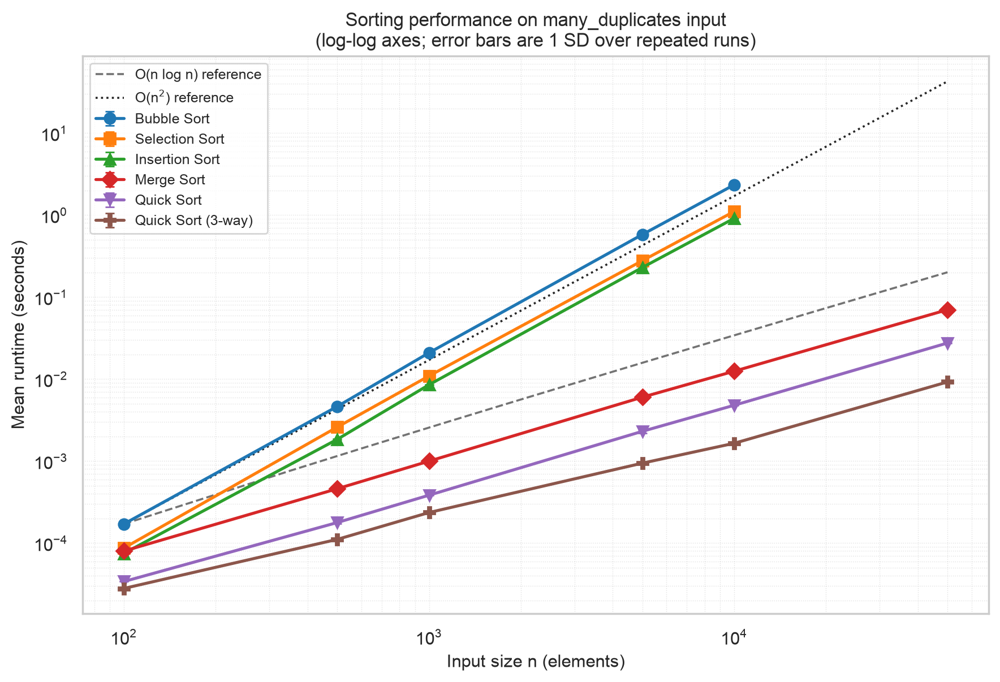
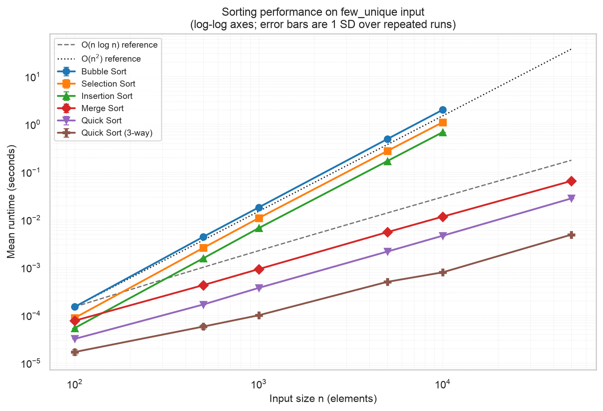

# Week 2 Technical Report — Divide and Conquer

**Robert Deibel** · CSC 5300 Advanced Algorithms · Concordia University Texas · Fall 2026

## 📎 Complete project repository

### **<https://github.com/RDeibel2025/CTX-Advanced-Algorithms>**

[Fourteen Master Theorem solutions](week2_recurrences.md).

---

## 1. Executive Summary

Merge sort and quicksort beat the Week 1 quadratics by a compounding factor
— parity at n = 100, 151× at n = 10,000 — and both matched O(n log n), with
doubling ratios of 2.12–2.19 and 2.12–2.32 against a predicted ~2.1. Quicksort's
O(n²) worst case never appeared on any shape. The most interesting result was
negative: three-way partitioning rescues duplicate-heavy input only from a
weakness Hoare's partition scheme lacks.

## 2. Methodology

Apple M2 Max, 12 cores, 64 GB RAM; macOS 14.5 (arm64); CPython 3.12.4; timing via
`time.perf_counter()`. Six algorithms (three Week 1 quadratics, merge, quicksort,
quicksort three-way) over sizes 100 … 50,000 and six shapes: random, sorted, reverse, nearly sorted (5% of positions transposed),
many duplicates (10 distinct values), few unique (3). Two warm-up runs are
discarded per cell, then five measured runs below n = 10,000, three above.
Generation is seeded; every algorithm receives the identical list per cell, and
every run is verified a sorted permutation. Median relative SD: 0.9%.

**The O(n²) size cap.** The quadratics were measured only to n = 10,000; the
eighteen cells at n = 50,000 appear in
[`comparison_table.csv`](../benchmarks/results/comparison_table.csv) as `omitted`
with a reason. Fitting t = c·n² projects 63 s, 29 s and 27 s
per run on random data — about an hour in total. I measured them anyway and
checked the projection
([`cap_validation.csv`](../benchmarks/results/cap_validation.csv)).

## 3. Results

Mean seconds at n = 10,000:

| Algorithm | random | sorted | reverse | nearly | many dup | few uniq |
|---|---|---|---|---|---|---|
| Bubble | 2.5266 | 0.0003 | 3.2459 | 1.6156 | 2.3425 | 2.0049 |
| Selection | 1.1502 | 1.1363 | 1.1819 | 1.1229 | 1.1082 | 1.0987 |
| Insertion | 1.0792 | 0.0006 | 2.1600 | 0.1333 | 0.9139 | 0.6810 |
| Merge | 0.0134 | 0.0096 | 0.0098 | 0.0119 | 0.0125 | 0.0116 |
| Quick | 0.0071 | 0.0052 | 0.0055 | 0.0053 | 0.0048 | 0.0046 |
| Quick 3-way | 0.0109 | 0.0106 | 0.0125 | 0.0098 | 0.0017 | 0.0008 |

Speedup over the best quadratic, random input:

| n | 100 | 500 | 1,000 | 5,000 | 10,000 |
|---|---|---|---|---|---|
| Merge | 1.0× | 4.4× | 9.8× | 42.8× | 80.6× |
| Quick | 1.9× | 8.9× | 18.7× | 86.0× | 151.4× |

The gap compounds, and at n = 100 insertion sort is actually *faster* than merge
sort (0.000080 s vs 0.000081 s). Asymptotic superiority is a claim about large n.

**Merge sort** was the most consistent algorithm measured — 1.4× variation across
all six shapes at both n = 10,000 and n = 50,000, against 10,573× for bubble and
3,763× for insertion. The positional split gives the same recursion tree whatever
the input order: no best or worst case to find. The price is O(n) auxiliary space.

**QuickSort** was fastest on five of six shapes, spread 1.4×: best on few-unique
(0.0046 s), worst on random (0.0071 s) — nothing like the O(n log n)-to-O(n²)
range theory permits.

**Surprising finding.** Three-way partitioning is *slower* than two-way wherever
values are mostly distinct — roughly half speed — and pays off only on
duplicate-heavy input: 3.0× at ten distinct values, 5.7× at three.

## 4. Complexity Validation

Observed t(2n)/t(n) over the 500→1,000 and 5,000→10,000 steps:

| Algorithm | random | sorted | reverse | few uniq | Predicted |
|---|---|---|---|---|---|
| Bubble | 4.33 | 2.12 | 4.26 | 4.11 | 4 / 2 adaptive |
| Selection | 4.11 | 4.11 | 4.08 | 4.09 | 4 |
| Insertion | 4.50 | 2.16 | 4.24 | 4.15 | 4 / 2 adaptive |
| Merge | 2.19 | 2.12 | 2.16 | 2.14 | ~2.1 |
| Quick | 2.32 | 2.17 | 2.24 | 2.19 | ~2.1 |

Merge sort lands within 0.1 of prediction everywhere. Bubble and insertion drop to
~2.1 on sorted input — their early exit appearing as a change of complexity class.

**Did I observe quicksort's O(n²) worst case? No.** Every shape gave a ratio near
2.2, including the three meant to be adversarial. Three mechanisms prevent it:
randomized pivots leave no fixed input adversarial, so the worst case needs an
unlucky *sequence of draws*; Hoare's partition splits a run of equal elements near
its middle rather than onto one side; and recursing into the smaller partition
caps stack depth at O(log n) — 10–14 frames measured at n = 100,000, against
Python's limit of 1,000.

Unreachable *by this implementation* is not unreachable. Lomuto's partition, the
scheme most often taught, reaches it at once:

| Scheme (3 values) | growth/doubling | t(16,000) |
|---|---|---|
| Lomuto (2-way) | **3.99** | 1.9368 s |
| Hoare (2-way) | 2.16 | 0.0079 s |
| Dutch flag (3-way) | 2.00 | 0.0016 s |

3.99 against a predicted 4 is the worst case, measured — 245× slower than Hoare
on identical input.

## 5. Optimization Impact

**Insertion-sort cutoff**, measured by varying the threshold. On random input at n = 50,000, disabling it costs 0.0563 s; a threshold of 10 gives
0.0389 s (**1.45×**) and the measured optimum of 20 gives 0.0353 s (1.59×). Past 20
the curve turns back up as insertion sort's O(k²) reasserts itself; on
nearly-sorted and few-unique input it was still improving at 80, so one global
constant is a compromise.

**Three-way partitioning:** 5.7× at three distinct values, 3.0× at ten, ~2× slower
otherwise. **Randomized pivot** cannot be isolated by timing — it shifts the
distribution, not the mean; its evidence is §4's negative result.

## 6. Practical Recommendations

- **n below ~100:** insertion sort — it beat merge sort there.
- **General purpose:** quicksort — randomized pivot, Hoare partition, insertion cutoff. Fastest overall, O(log n) space.
- **Stability or a guarantee:** merge sort, 1.9× slower on random input.
- **Duplicate-heavy data:** three-way partitioning.
- **Never use Lomuto without a duplicate guard.**

## 7. Conclusion

Measurement matched theory closely enough that the interesting results were where
it did not: asymptotic advantage is real but only past a crossover that must be
measured, quicksort's notorious worst case belongs to the partition scheme rather
than to quicksort, and three-way partitioning is a trade, not a free win.

## 8. References

- Cormen, Leiserson, Rivest, Stein. *Introduction to Algorithms*, 4th ed., Ch. 2.3–2.4, 4, 7.
- Amakobe. *Advanced Computational Algorithms*, 2nd ed., Ch. 2.
- Sedgewick, Wayne. *Algorithms*, 4th ed., §2.3.

## AI use acknowledgement

I used Anthropic's Claude (Claude Code) to draft the code, tests and first draft of
this report, from a specification I wrote off the assignment instructions and the
assigned reading. The measurements are my own, run on my machine, every figure
above computed from the result CSVs by
[`tools/week2_facts.py`](../tools/week2_facts.py) rather than transcribed. The
design decisions were mine — Hoare's partition over Lomuto's, recursing into the
smaller partition, and measuring the capped cells rather than projecting them.
Full disclosure: [`docs/AI_USE.md`](../docs/AI_USE.md).
