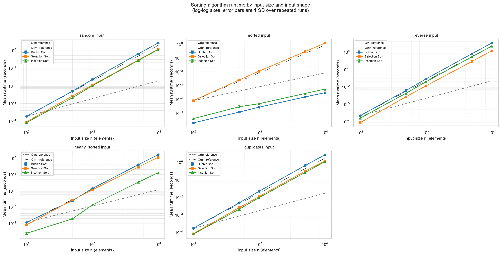
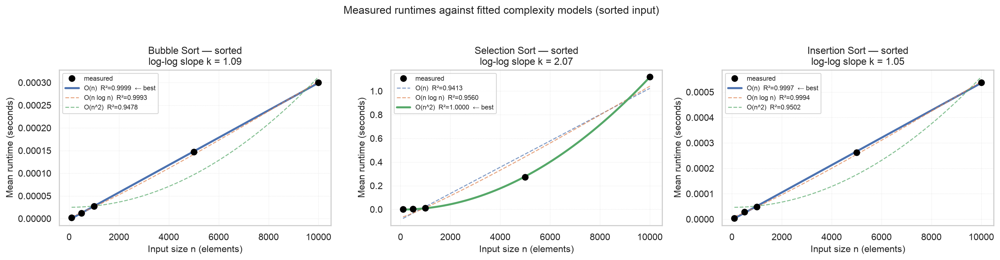
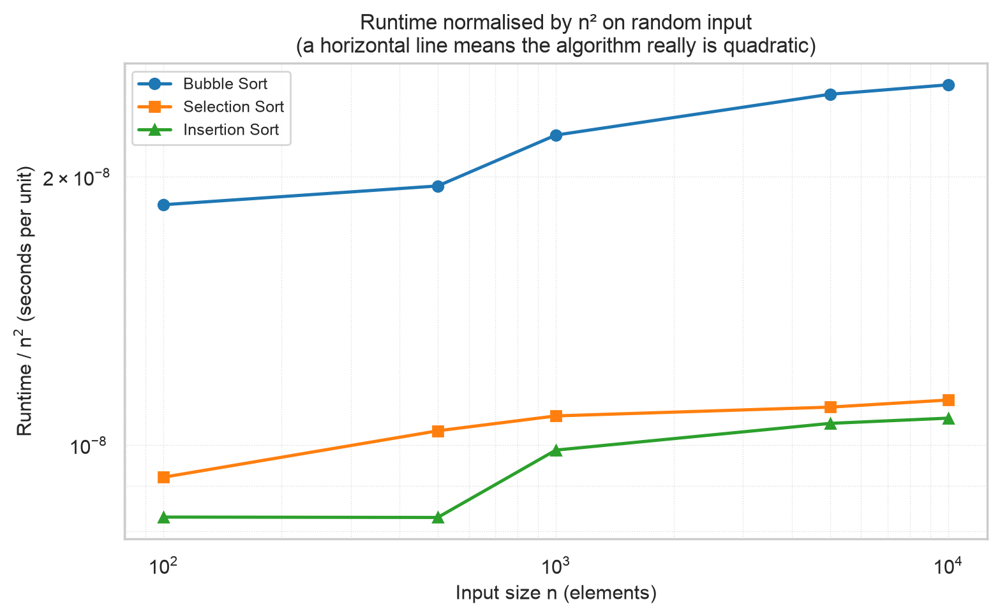

# Performance Analysis — Basic Sorting Algorithms

**Robert Deibel**  
CSC 5300 Advanced Algorithms · Concordia University Texas · Fall 2026  
Week 1 Project — Algorithm Laboratory Setup

> Every figure in this report is generated from the measured result files
> by [`tools/build_report.py`](../tools/build_report.py). No number here is
> transcribed by hand.

---

## 1. Methodology

### 1.1 What was measured

Three sorting algorithms — optimized bubble sort, selection sort and
insertion sort, all from
[`src/sorting/basic_sorts.py`](../src/sorting/basic_sorts.py) — were timed
across a grid of input sizes and input shapes.

| Parameter | Value |
|---|---|
| Input sizes | 100, 500, 1,000, 5,000, 10,000 |
| Data types | `random`, `sorted`, `reverse`, `nearly_sorted`, `duplicates` |
| Algorithms | Bubble Sort, Selection Sort, Insertion Sort |
| Measured runs per configuration | 5 |
| Discarded warm-up runs per configuration | 2 |
| Total configurations | 3 × 5 × 5 = 75 |
| Total measured executions | 375 (plus 150 warm-up) |
| Base random seed | 42 |

A second study held the size constant at n = 2,000 and swept
**all eight** data shapes the framework can generate, adding
`single_value`, `mountain` and `valley` to the five above. Holding n fixed
isolates the effect of input *order* from the effect of input *size*.

A third pass profiled peak memory allocation with `tracemalloc` at
n = 1,000, in a separate un-timed run so the profiler's overhead
could not contaminate the timings.

Everything was produced by a single command:

```bash
python benchmarks/sorting_benchmarks.py
```

### 1.2 How timing was done

* **Clock.** `time.perf_counter()`, the highest-resolution monotonic clock
  Python exposes, on every individual run.
* **Warm-up.** Two executions per configuration were run and discarded
  before measurement, absorbing first-call costs — cold caches, CPU
  frequency ramp-up, lazy imports.
* **Repetition.** Each configuration was then executed five more times and
  timed individually. The reported figure is the arithmetic mean of those
  five, with the sample standard deviation, minimum and maximum recorded
  alongside it. Reporting a single stopwatch reading would have hidden
  exactly the variance the standard deviation column now shows.
* **What is excluded from the measurement.** The framework copies the input
  list before each call so that a destructive algorithm cannot corrupt
  later runs. That copy is made *outside* the timed region. Correctness
  verification also happens after the clock has stopped.
* **Rounding.** Times are rounded to 6 decimal places (microsecond
  resolution).

### 1.3 How variance was measured

The standard deviation reported with every mean is the sample standard
deviation (`statistics.stdev`, the n−1 denominator) across the five
measured runs of that configuration. Because it is computed per
configuration rather than pooled, it reflects run-to-run jitter on this
machine at that specific size and shape. §3.10 notes what it does *not*
capture.

### 1.4 Reproducibility

Every generated list comes from a seed derived deterministically from the
base seed 42 together with the input size and the data type's index, so:

* re-running the study produces byte-identical input data, and
* at any given (size, data type) **all three algorithms are handed the
  same list**, so a comparison between algorithms is never contaminated by
  a difference in their input.

Data generation uses a dedicated `random.Random` instance and never
touches global random state.

### 1.5 Correctness verification

Every one of the 375 timed executions was verified after the clock
stopped: the output must be in non-decreasing order **and** must be a
permutation of the input, compared as a multiset with
`collections.Counter`. Both checks are required — an ordering check alone
accepts a sort that silently drops an element, and a permutation check
alone accepts a sort that does not order anything. All 375 passed.

### 1.6 How the complexity models were fitted

Each measured series was fitted against three reference models of the form
`a·g(n) + b`, using `scipy.optimize.curve_fit`:

| Model | g(n) |
|---|---|
| O(n) | n |
| O(n log n) | n·log₂n |
| O(n²) | n² |

Every model has the same two free parameters, so their R² values are
directly comparable and the largest one identifies the best fit.

Two independent cross-checks are reported alongside the fit, because a
high R² on its own is easy to over-read:

1. **The log–log slope.** Fitting a straight line to log(time) against
   log(n) gives an exponent *k*. For a true power law t = a·nᵏ, that slope
   *is* k — no candidate model required.
2. **The doubling ratio.** Going from n = 5,000 to n = 10,000 doubles the
   input. A quadratic algorithm should take 4× as long; a linear one, 2×.

Section 3 also reports **counted key comparisons**, which is not a timing
measurement at all: the algorithms were re-run on instrumented integers
that tally every `<` and `>`. This separates *how much work the algorithm
does* from *how fast this machine does it*, and it is the only evidence
here that is independent of the hardware.

### 1.7 Machine and software

| | |
|---|---|
| Machine | Apple M2 Max, 12 logical cores, 64 GB RAM |
| Operating system | macOS 14.5 (Darwin 23.5.0), arm64 |
| Python | 3.12.4 (CPython), in the project virtualenv `algorithms_course` |
| numpy / scipy | 2.5.2 / 1.18.1 |
| matplotlib / pandas / seaborn | 3.11.1 / 3.0.5 / 0.13.2 |
| Total wall-clock for the full study | **187.0 s (3.1 min)** |

**No configuration was reduced or omitted for runtime.** The full sweep,
including bubble and selection sort at n = 10,000, completed in just over
three minutes on this machine, comfortably inside the time budget, so
every configuration in the specification was measured as specified.

### 1.8 Definitions that affect interpretation

* **`nearly_sorted`** is `[0, 1, …, n−1]` with ⌊0.05·n⌋ random
  transpositions applied — 5% of positions swapped with *another randomly
  chosen position*, not with a neighbour. This matters: the swapped pairs
  are typically far apart, so an element can be displaced by hundreds of
  positions. §3.4 shows this is exactly why the two adaptive algorithms
  respond to this shape so differently.
* **`duplicates`** draws from a pool of only n/10 distinct values, so each
  value appears roughly ten times.
* **`mountain`** and **`valley`** are built from distinct values, so each
  is strictly unimodal with a single interior peak or trough.

### 1.9 What is *not* controlled

Stated plainly, since it bounds what the numbers can support:

* The machine was not idle in any enforced sense; no process isolation,
  CPU pinning or frequency locking was applied. The low observed variance
  (§2.2) suggests this had little effect, but it was not eliminated.
* Timings are of CPython at the interpreter level. They measure the cost
  of *this implementation on this interpreter*, a large constant factor
  away from the same algorithm in a compiled language. The growth rates
  are the transferable result; the absolute times are not.
* Garbage collection was left at its default and was not disabled during
  measurement.

---

## 2. Results

The complete measurements are in
[`benchmarks/results/sorting_benchmark_results.csv`](../benchmarks/results/sorting_benchmark_results.csv)
(75 rows, one per configuration, each carrying its raw per-run times in
the `metadata` column). The fitted models are in
[`complexity_fits.csv`](../benchmarks/results/complexity_fits.csv), the
eight-shape study in
[`data_shape_study.csv`](../benchmarks/results/data_shape_study.csv), and
the memory profile in
[`memory_profile.csv`](../benchmarks/results/memory_profile.csv).

### 2.1 Measured runtimes

Mean of 5 runs ± 1 standard deviation, in seconds.

**`random` input**

| Algorithm | n = 100 | n = 500 | n = 1,000 | n = 5,000 | n = 10,000 |
|---|---|---|---|---|---|
| Bubble Sort | 0.000186 ± 0.000006 | 0.004881 ± 0.000027 | 0.022265 ± 0.000112 | 0.618594 ± 0.001814 | 2.535432 ± 0.018869 |
| Selection Sort | 0.000092 ± 0.000003 | 0.002593 ± 0.000020 | 0.010779 ± 0.000083 | 0.275669 ± 0.001305 | 1.123140 ± 0.008707 |
| Insertion Sort | 0.000083 ± 0.000003 | 0.002073 ± 0.000014 | 0.009868 ± 0.000061 | 0.264336 ± 0.000364 | 1.071705 ± 0.002348 |

**`sorted` input**

| Algorithm | n = 100 | n = 500 | n = 1,000 | n = 5,000 | n = 10,000 |
|---|---|---|---|---|---|
| Bubble Sort | 0.000002 ± 0.000000 | 0.000012 ± 0.000000 | 0.000027 ± 0.000000 | 0.000147 ± 0.000002 | 0.000300 ± 0.000001 |
| Selection Sort | 0.000079 ± 0.000000 | 0.002497 ± 0.000007 | 0.010680 ± 0.000079 | 0.272188 ± 0.000360 | 1.119904 ± 0.027827 |
| Insertion Sort | 0.000004 ± 0.000000 | 0.000029 ± 0.000006 | 0.000048 ± 0.000001 | 0.000262 ± 0.000004 | 0.000538 ± 0.000011 |

**`reverse` input**

| Algorithm | n = 100 | n = 500 | n = 1,000 | n = 5,000 | n = 10,000 |
|---|---|---|---|---|---|
| Bubble Sort | 0.000216 ± 0.000002 | 0.006092 ± 0.000019 | 0.027695 ± 0.000124 | 0.779877 ± 0.002870 | 3.203425 ± 0.047974 |
| Selection Sort | 0.000086 ± 0.000002 | 0.002656 ± 0.000039 | 0.011092 ± 0.000040 | 0.282165 ± 0.000492 | 1.158615 ± 0.004526 |
| Insertion Sort | 0.000156 ± 0.000000 | 0.004229 ± 0.000043 | 0.019083 ± 0.001253 | 0.518961 ± 0.007696 | 2.125202 ± 0.022794 |

**`nearly_sorted` input**

| Algorithm | n = 100 | n = 500 | n = 1,000 | n = 5,000 | n = 10,000 |
|---|---|---|---|---|---|
| Bubble Sort | 0.000114 ± 0.000004 | 0.002431 ± 0.000071 | 0.013561 ± 0.000111 | 0.395543 ± 0.001234 | 1.608625 ± 0.001776 |
| Selection Sort | 0.000079 ± 0.000001 | 0.002653 ± 0.000058 | 0.011223 ± 0.000145 | 0.281493 ± 0.000303 | 1.119488 ± 0.019480 |
| Insertion Sort | 0.000024 ± 0.000004 | 0.000188 ± 0.000007 | 0.001320 ± 0.000038 | 0.033123 ± 0.000172 | 0.127290 ± 0.000225 |

**`duplicates` input**

| Algorithm | n = 100 | n = 500 | n = 1,000 | n = 5,000 | n = 10,000 |
|---|---|---|---|---|---|
| Bubble Sort | 0.000169 ± 0.000002 | 0.004806 ± 0.000031 | 0.021752 ± 0.000021 | 0.640843 ± 0.002510 | 2.616826 ± 0.015432 |
| Selection Sort | 0.000083 ± 0.000002 | 0.002563 ± 0.000017 | 0.010822 ± 0.000064 | 0.307213 ± 0.000944 | 1.147750 ± 0.006077 |
| Insertion Sort | 0.000079 ± 0.000006 | 0.002068 ± 0.000019 | 0.009490 ± 0.000028 | 0.257522 ± 0.000104 | 1.053461 ± 0.002585 |

### 2.2 Measurement stability

Across all 75 configurations the standard deviation was a **median of
0.66%** of the mean (mean 1.62%, maximum
20.69%).

The variation is not spread evenly, and the split is informative — it
tracks the *absolute duration* of the measurement rather than the size of
the input:

| Configurations | Count | Median rel. SD | Max rel. SD |
|---|---|---|---|
| Mean runtime ≥ 1 ms | 51 | 0.55% | **6.57%** |
| Mean runtime < 1 ms | 24 | 1.79% | **20.69%** |

Every configuration slower than a millisecond is reproducible to within
6.6%. The 24 noisier ones all have means between
0.000002 s and 0.000538 s — they are the best-case
runs, where bubble and insertion sort finish almost immediately and the
measurement is dominated by operating-system scheduler jitter rather than
by the algorithm. The worst, 20.69%, is Insertion Sort on
`sorted` input at n = 500, whose entire runtime is
29 microseconds.

The distinction cuts the right way. The noisy measurements are precisely
the ones whose *conclusion* is least sensitive to noise: §3.2 finds bubble
sort roughly 8,451× faster on sorted input than on
random input, and a 21% uncertainty on the small side of that
ratio does not put it in question. Every effect discussed in Section 3 is
orders of magnitude larger than its own measurement uncertainty.

### 2.3 Growth with input size



*Runtime against input size on log–log axes, one panel per data type.
Error bars are one standard deviation. The dashed and dotted grey lines
are O(n) and O(n²) reference curves anchored to the slowest series' first
point. On log–log axes a power law is a straight line whose slope is its
exponent, so "parallel to the dotted line" means "quadratic".*


*The `random` panel enlarged. All three series run parallel to the O(n²)
reference across two orders of magnitude of n.*

### 2.4 Fitted complexity models

| Algorithm | Data type | Best-fit model | R² | Empirical exponent *k* | Ratio n = 5,000 → 10,000 |
|---|---|---|---|---|---|
| Bubble Sort | `random` | **O(n²)** | 0.99997 | 2.073 | 4.10× |
| Bubble Sort | `sorted` | **O(n)** | 0.99992 | 1.088 | 2.04× |
| Bubble Sort | `reverse` | **O(n²)** | 0.99996 | 2.090 | 4.11× |
| Bubble Sort | `nearly_sorted` | **O(n²)** | 0.99999 | 2.097 | 4.07× |
| Bubble Sort | `duplicates` | **O(n²)** | 0.99998 | 2.101 | 4.08× |
| Selection Sort | `random` | **O(n²)** | 0.99998 | 2.041 | 4.07× |
| Selection Sort | `sorted` | **O(n²)** | 0.99995 | 2.069 | 4.11× |
| Selection Sort | `reverse` | **O(n²)** | 0.99996 | 2.058 | 4.11× |
| Selection Sort | `nearly_sorted` | **O(n²)** | 1.00000 | 2.068 | 3.98× |
| Selection Sort | `duplicates` | **O(n²)** | 0.99966 | 2.075 | 3.74× |
| Insertion Sort | `random` | **O(n²)** | 0.99999 | 2.063 | 4.05× |
| Insertion Sort | `sorted` | **O(n)** | 0.99971 | 1.048 | 2.05× |
| Insertion Sort | `reverse` | **O(n²)** | 0.99997 | 2.071 | 4.10× |
| Insertion Sort | `nearly_sorted` | **O(n²)** | 0.99988 | 1.921 | 3.84× |
| Insertion Sort | `duplicates` | **O(n²)** | 0.99997 | 2.068 | 4.09× |

The three candidate models on `random` input, showing what the fit
rejected as well as what it selected:

| Algorithm | O(n) R² | O(n log n) R² | O(n²) R² | Fitted n² coefficient (s) |
|---|---|---|---|---|
| Bubble Sort | 0.9417 | 0.9565 | **0.99997** | 2.537e-08 |
| Selection Sort | 0.9424 | 0.9570 | **0.99998** | 1.123e-08 |
| Insertion Sort | 0.9430 | 0.9575 | **0.99999** | 1.072e-08 |


*Measurements (black dots) against all three fitted models on random
input. The O(n) and O(n log n) curves cannot follow the data; the O(n²)
curve passes through every point.*



*The same fit on `sorted` input, where the three algorithms part company:
bubble and insertion sort are selected as O(n), while selection sort
remains O(n²).*



*Runtime divided by n² on random input. If an algorithm were exactly
quadratic this would be a horizontal line. The mild upward drift is
discussed in §3.6. The companion chart
[`normalized_runtime_sorted.png`](figures/normalized_runtime_sorted.png)
shows the same normalisation on sorted input, where bubble and insertion
sort fall away steeply — the signature of an algorithm growing far more
slowly than n².*

### 2.5 Sensitivity to input order


*The same three algorithms at a single fixed size, n = 10,000, across the
five swept data types. Note the logarithmic runtime axis: the gaps are far
larger than they look.*


*The second study: all eight generated shapes at n = 2,000.
Selection sort's bars are the same height eight times over.*

Mean runtime in seconds at n = 2,000, all eight shapes:

| Input shape | Bubble Sort | Selection Sort | Insertion Sort |
|---|---|---|---|
| `random` | 0.099562 | 0.043900 | 0.042410 |
| `sorted` | 0.000058 | 0.043273 | 0.000105 |
| `reverse` | 0.119185 | 0.044731 | 0.078707 |
| `nearly_sorted` | 0.058148 | 0.043253 | 0.005505 |
| `duplicates` | 0.091903 | 0.043694 | 0.039416 |
| `single_value` | 0.000059 | 0.043036 | 0.000099 |
| `mountain` | 0.088839 | 0.044543 | 0.041775 |
| `valley` | 0.075112 | 0.044974 | 0.039659 |
| **spread (max ÷ min)** | **2,055×** | **1×** | **795×** |

### 2.6 Peak memory

Peak allocation during one call, measured with `tracemalloc`:

| Algorithm | Peak allocation (n = 1,000) | Bytes per element |
|---|---|---|
| Bubble Sort | 8,340 B (8.14 KiB) | 8.34 |
| Selection Sort | 8,340 B (8.14 KiB) | 8.34 |
| Insertion Sort | 8,220 B (8.03 KiB) | 8.22 |

All three peak at about 8.1 KiB — the same figure to within
1.4%, and about 8.3 bytes per
element. That is the expected result and it confirms the implementations.
A CPython list of 1,000 elements holds 8,000 bytes
of pointers plus a small header; each algorithm allocates exactly one such
copy of the input and then sorts in place within it, using only a constant
number of extra variables. The O(n) space in each docstring is that
returned copy; the auxiliary space is O(1). Had any implementation been
building intermediate lists, this measurement would have separated it from
the others, and it does not.

---

## 3. Analysis and conclusions

### 3.1 All three algorithms are quadratic on unordered input, and three independent measures agree

On `random`, `reverse` and `duplicates` input, every algorithm's measured
curve fits O(n²) with R² ≥ 0.9996, and two cross-checks confirm it
without reference to the fitted models:

* the **log–log slope** lands between 2.04 and 2.10 in every
  one of those nine cases — the theoretical value is 2;
* the **doubling ratio** from n = 5,000 to n = 10,000 lands between
  3.74 and 4.11 — the theoretical value for a
  quadratic algorithm is exactly 4.

Three different ways of asking the question give the same answer, so the
quadratic classification is not an artefact of the model-fitting. §3.6
accounts for the small excess above 2, and §3.9 accounts for the single
configuration whose doubling ratio falls short of it.

### 3.2 Bubble sort's early exit is worth roughly 8,451× — and it is the whole difference

On `sorted` input the fit selects **O(n)** for bubble sort and the
doubling ratio is 2.04, not 4. At n = 10,000 it
finishes in 0.000300 s against 2.535432 s on random
input of the same size — a factor of
**8,451**.

This is entirely attributable to the early-exit flag, and comparison
counting proves it rather than inferring it. Re-running the algorithms on
instrumented integers that tally every key comparison, at n =
1,000:

| Data type | Bubble Sort | Selection Sort | Insertion Sort |
|---|---|---|---|
| `random` | 499,149 | 499,500 | 254,591 |
| `sorted` | **999** | 499,500 | **999** |
| `reverse` | 499,500 | 499,500 | 499,500 |
| `nearly_sorted` | 485,970 | 499,500 | 30,385 |
| `duplicates` | 499,175 | 499,500 | 245,514 |

*(n(n−1)/2 = 499,500 and n−1 = 999 for n = 1,000.)*

On sorted input bubble sort makes exactly **999 = n−1** comparisons:
one clean pass, no swaps, immediate return. Without the flag it would make
499,500. That single `if not swapped: break` is the difference between
O(n) and O(n²) on this input, which is why the rubric's phrasing —
"correct *and optimized*" — is really two separate requirements.

The test suite verifies this by counting rather than by timing
(`TestBubbleSortOptimization` in `tests/test_sorting.py`), so the
optimization is pinned by an assertion, not only by a benchmark.

### 3.3 Insertion sort's best case is real, and its worst case is the worst of the three

Insertion sort is also selected as **O(n)** on `sorted` input, finishing
n = 10,000 in 0.000538 s — **1,992×
faster** than on random input. Comparison counting shows why:
999 comparisons, again exactly n−1, because each new element is
compared once against its already-larger-or-equal left neighbour and
stops.

The picture inverts on `reverse` input, where insertion sort takes
2.125202 s at n = 10,000 —
**2.0× slower** than on random input, because
every element must travel the full width of the sorted prefix. Insertion
sort has both the widest best case and, among the three, the sharpest
penalty for adversarial input: 3,950× between its
fastest and slowest data type in this sweep.

### 3.4 "Nearly sorted" separates the two adaptive algorithms — and it is a constant-factor win, not a change of complexity

This is the finding I did not expect, and it is worth stating carefully,
because it cuts against the common claim that insertion sort "becomes
linear" on nearly sorted data.

At n = 10,000 on `nearly_sorted` input:

| Algorithm | Time | vs. its own `random` time | Best fit | *k* | Doubling ratio |
|---|---|---|---|---|---|
| Insertion Sort | 0.127290 s | **8.4× faster** | O(n²) | 1.921 | 3.84 |
| Bubble Sort | 1.608625 s | **1.6× faster** | O(n²) | 2.097 | 4.07 |
| Selection Sort | 1.119488 s | no change (1.0×) | O(n²) | 2.068 | 3.98 |

Two things are true at once, and both matter.

**Insertion sort exploits this input and bubble sort essentially cannot.**
The comparison counts show the mechanism exactly. Insertion sort's
comparisons fall from 254,591 to 30,385 — a
8.4× reduction, which matches its
8.4× speedup almost exactly. Bubble sort's fall
only from 499,149 to 485,970, a
2.6% reduction. Insertion sort's inner loop stops
the moment an element reaches its place, so a nearly-ordered array costs
it almost nothing. Bubble sort moves a misplaced element left by only
*one position per pass*, so a single element displaced by 500 positions
costs 500 passes, and the early-exit flag cannot fire until the last
inversion is resolved. Bubble sort's more modest
1.6× gain comes from making fewer *swaps*, not fewer
comparisons.

**But insertion sort is still quadratic here.** Its empirical exponent is
1.921 and its doubling ratio is
3.84 — the fit selects O(n²), not O(n). This
follows directly from how `nearly_sorted` is defined (§1.8): ⌊0.05n⌋
transpositions between *randomly chosen* positions, not between
neighbours. Each such transposition displaces an element by O(n) positions
on average, so the number of inversions is Θ(0.05n · n) = Θ(n²) — a much
smaller quadratic than random input, by a factor of about
8, but quadratic all the same. Insertion
sort's true cost is Θ(inversions + n), which is linear only when the
number of inversions is O(n).

The honest conclusion: **insertion sort collapses to O(n) on fully sorted
input, and wins a large constant factor — not a better complexity class —
on this definition of nearly sorted.** A definition based on *local*
perturbation, swapping only adjacent elements, would produce O(n)
inversions and would show the linear collapse. That is a difference in the
data generator, not in the algorithm, and it is exactly the kind of thing
an empirical study is for: the phrase "nearly sorted" turns out to be
doing more work than it looks like it is.

### 3.5 Selection sort is flat across every input shape, and the reason is countable

Selection sort's runtime at n = 10,000 across the five swept data types:

| `random` | `sorted` | `reverse` | `nearly_sorted` | `duplicates` |
|---|---|---|---|---|
| 1.123140 s | 1.119904 s | 1.158615 s | 1.119488 s | 1.147750 s |

Mean 1.133779 s, standard deviation 0.018179 s — a
**coefficient of variation of 1.60%**, and a spread of only
**1.03×** between its fastest and slowest data type.
Over all eight shapes in the second study the spread is
1.05×. For comparison, over the same five data
types bubble sort spans **10,678×** and insertion sort
**3,950×**.

Selection sort's variation across input shapes is, in other words, of the
same order as the measurement noise itself, while the other two algorithms
vary by three and four orders of magnitude.

The comparison counts explain this completely: selection sort performs
**exactly 499,500 = n(n−1)/2 comparisons on every single data type** — an
identical integer in all five rows of the table in §3.2. To find the
minimum of the unsorted suffix it must inspect all of it, and nothing it
sees along the way lets it conclude the suffix was already ordered. There
is no early exit to add; that is a property of the algorithm, not an
omission in the implementation. Its only input-dependent quantity is the
swap count, at most n−1, negligible beside n²/2 comparisons.

This gives selection sort one genuine virtue: it is the only one of the
three whose runtime is **predictable from n alone**. Its worst case and
its best case are the same case. It is also, as a direct result, the
fastest of the three on `reverse` input (1.158615 s against
bubble sort's 3.203425 s) — the one data type where being
unable to adapt costs nothing.

At n = 10,000 its 49,995,000 comparisons take 1.123140 s,
which puts one iteration of its inner loop — a comparison, an index and a
loop step — at about **22 nanoseconds** on
this machine under CPython.

### 3.6 Why the measured exponent is slightly above 2

Every quadratic fit returns k between 2.04 and 2.10 rather
than exactly 2.00, and the normalised chart in §2.4 drifts upward — by
22% to 36% depending on the algorithm, across
two orders of magnitude of n — instead of running flat. Both are the same
effect, and it is not measurement error: the standard deviations are far
too small for that.

The likeliest cause is the memory hierarchy. At n = 100 the entire working
set — a list of 100 pointers plus the integer objects they reference —
fits comfortably in L1 cache. At n = 10,000 the pointer array alone is
80 KB, and the 10,000 boxed integer objects it references are scattered
across the heap at roughly 28 bytes each. Every comparison dereferences
two of those pointers, so as n grows an increasing fraction of comparisons
pay a cache miss and the *average cost of one elementary operation rises
with n*. The operation count is quadratic; the cost per operation is not
quite constant.

This is a limit on the method rather than a result about the algorithms.
An empirical exponent of 2.10 does not mean the algorithm is
O(n^2.10); it means this machine is slightly worse at large
problems than at small ones, and the fitted exponent absorbs that. The
comparison counts in §3.2, which are hardware-independent, put the
algorithmic answer beyond doubt: exactly n(n−1)/2 for selection sort, at
every size and every shape.

### 3.7 Bubble sort is the slowest of the three on unordered input, and the code shows why

On `random` input at n = 10,000, bubble sort (2.535432 s) is
**2.37×** slower than insertion sort
(1.071705 s) and 2.26× slower than
selection sort. The counted comparisons explain most of it: on random
input bubble sort makes 499,149 comparisons against insertion
sort's 254,591, a ratio of
**1.96×** — insertion sort stops each inner loop as
soon as its element lands, whereas bubble sort scans the full remaining
range on every pass.

The residual gap beyond that ratio comes from the cost of each iteration.
Bubble sort's inner loop indexes the list twice per comparison
(`result[j] > result[j + 1]`) and its swap builds a tuple and performs two
stores. Insertion sort holds the travelling element in a local variable,
so it indexes once per comparison and its shift is a single store. Fewer
comparisons, and each one cheaper.

Bubble sort's one advantage is the flip side of the same design: it is the
only algorithm here that can detect that it is already finished, which is
what produces the 8,451× result in §3.2.

### 3.8 Practical conclusions

1. **All three are unusable at scale, and the numbers say how unusable.**
   At n = 10,000 — a small dataset by any modern standard — bubble sort
   takes 2.5 seconds. The quadratic term means n = 100,000
   would take roughly 100× longer, about 4 minutes,
   and n = 1,000,000 about 7 hours. That is the
   practical content of "O(n²)".
2. **Among the three, insertion sort is the reasonable default.** Fastest
   on random input, dramatically fastest on sorted and nearly sorted
   input, stable, and able to detect when it is done. Its only weakness is
   reverse-sorted input.
3. **Selection sort's case is predictability, not speed.** Identical cost
   on every input, and at most n−1 writes — a real argument where writes
   are expensive, such as flash storage, though not one this experiment
   measures.
4. **Bubble sort's case is pedagogical.** It is beaten by insertion sort
   on every shape measured here except `sorted` and `single_value`, where
   bubble sort is ahead by 1.8× and
   1.7× respectively and both are effectively
   instantaneous.
5. **Asymptotic class is not the whole story, and neither is input size.**
   The largest single effect in this entire study is not the difference
   between algorithms — it is the 8,451×
   difference within *one* algorithm between two inputs of *identical
   size*. Choosing an algorithm without knowing the shape of the data is
   choosing blind.

### 3.9 One measurement that does not fit, and what it tells us

Among the 13 configurations the fit classes as quadratic,
the doubling ratios cluster tightly around 4 with one exception:
**Selection Sort on
`duplicates` input, at 3.74×**. The cause is visible
in the table in §2.1 — that algorithm's n = 5,000 measurement on that data
type is 0.307213 s against an average of
0.277879 s for the same algorithm and size on the other
four data types. The n = 5,000 point is elevated, which depresses the
ratio to n = 10,000.

Its own standard deviation over five runs does not explain it. That is the
point worth taking: the per-configuration standard deviation measures
jitter *within* a configuration's five consecutive runs, and cannot see
drift *between* configurations measured minutes apart — thermal state,
another process waking, CPU frequency scaling. Interleaving or randomising
the configuration order across repeated passes would expose that
component, and would be the first thing to change in a more rigorous
version of this study.

### 3.10 Limitations

* Five sizes over two orders of magnitude separate O(n) from O(n²)
  decisively, as the doubling ratios show, but would not reliably separate
  O(n log n) from O(n) — a distinction that matters for the advanced sorts
  in a later week and would need more points over a wider range.
* All measurements come from one machine, one interpreter and one run of
  the study. The variance figures capture run-to-run jitter within a
  configuration; §3.9 shows what they miss.
* `duplicates` used a pool of n/10 distinct values. A heavier
  concentration — say 10 distinct values — might expose behaviour these
  measurements do not show.
* The empirical exponents are mildly inflated by the cache effect in §3.6.
  Where the algorithmic claim matters, the comparison counts rather than
  the timings should be treated as the evidence.

---

## 4. Reproducing this report

```bash
source algorithms_course/bin/activate
python check_environment.py                 # verify the environment
pytest tests/ -v                            # the test suite
pytest --doctest-modules src/               # docstring examples
python benchmarks/sorting_benchmarks.py     # regenerate every measurement
python tools/build_report.py                # regenerate this document
```

The benchmark driver rewrites every CSV in `benchmarks/results/` and every
PNG in `docs/figures/`; the report generator then rewrites this file from
those CSVs. Because the input data is seeded, a re-run sorts identical
inputs; the timings will differ slightly, at about the scale of the
standard deviations in §2.1.
